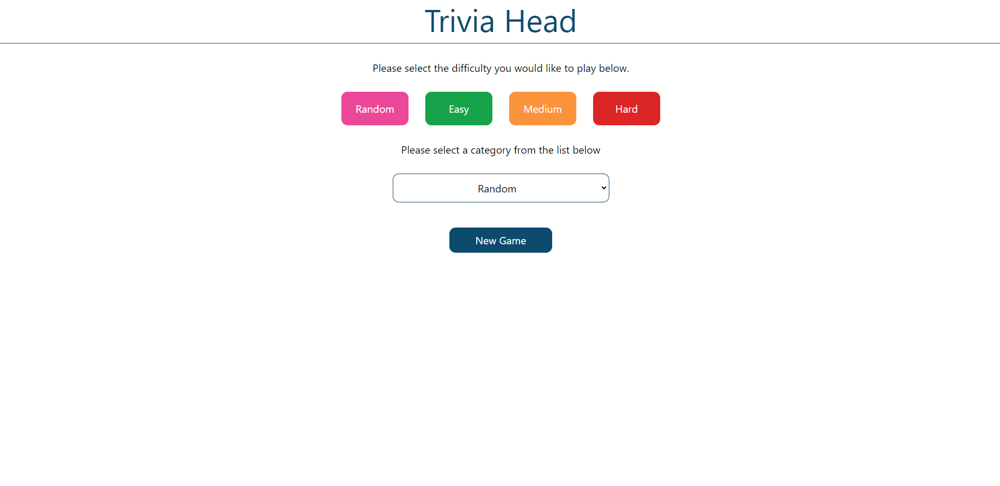
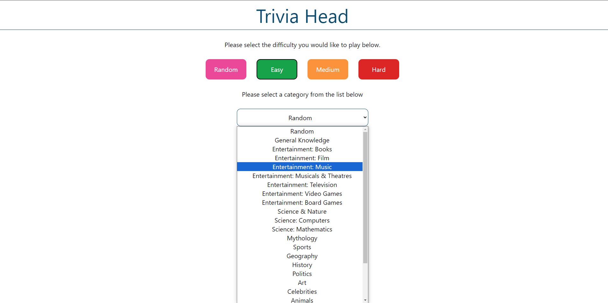
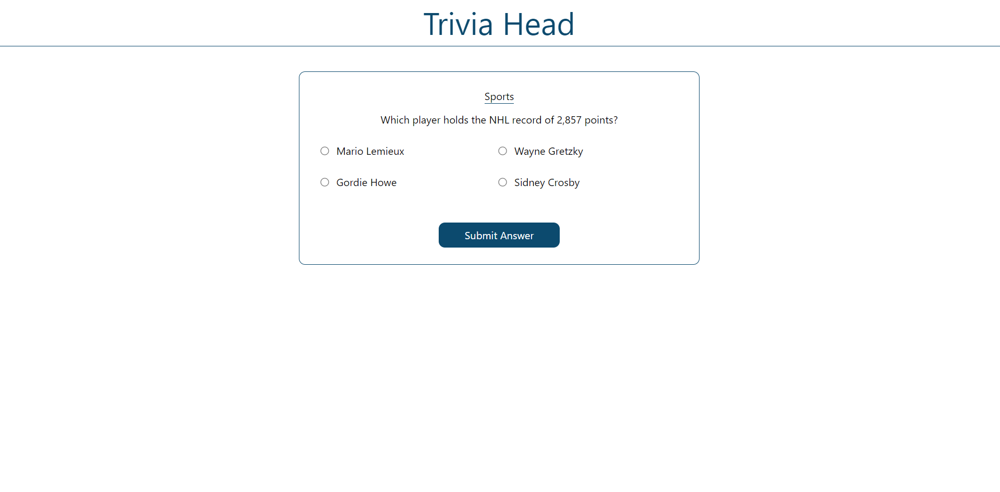
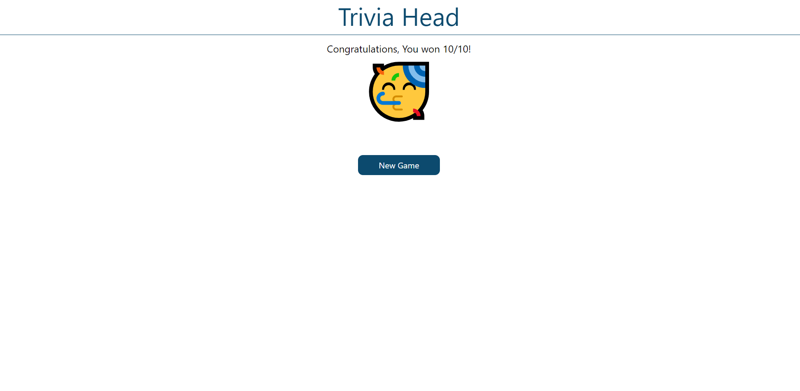
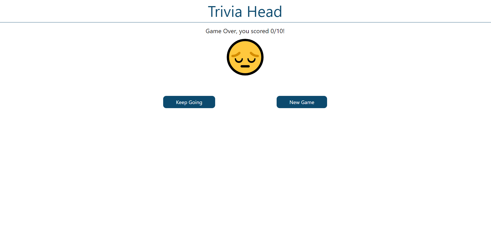

# Trivia UI

This is a trivia game that uses the [Open Trivia Database](https://opentdb.com/) API to source the questions and answers.

You can see the live project [Here](https://trivia-4axjh1rne-max-cossart.vercel.app/)!

## Table of Contents

- [Features](#features)
- [Tech Stack](#tech-stack)
- [Requirements](#requirements)
  - [MVP](#mvp)
  - [Bonus](#bonus)
- [Known Issues](#known-issuses)
- [Future Goals](#future-goals)

## Features

- This is the Landing page, here you pick the difficulty you would like to play and the category.

- The categories are all drawn from the api and added to the list, Once picked it will send off the api request with the category you have chosen.

- The questions are all structure and displayed as shown below. They will all be multiple choice questions with either for answers to choose from or a true/false question.

- Below is the page shown if you win the game getting 10/10 questions.

- Below is the page shown if you lose the game showing your score dynamically depending on how questions you correctly answered.

## Tech Stack

- React
- TypesScript
- Tailwind CSS
- Fetch
- React Hook Forms

## Requirements

### MVP

- Create an interface that will allow a user to choose level of difficulty and start a new game
- When game starts, the user should see a question card with 4 possible answers
- If they answer the question correct, a new question should appear on the screen
- If their answer is incorrect, the game is over
- Display the score (number of question answered correctly) at the end of each game
- Add a "Play Again" button under the score

### Bonus

- Allow the user to select a category of questions
- Add a time countdown to each question, when a question is not answered before the time is up, game ends

## Known Issues

- When a true or false follows another the same answer can't be selected again.
- I have not you made it responsive so it does not work on small screens.

## Future Goals

- Fix the bug listed above.
- Add the timer for each question as the bonus states.
- Make the app playable on mobile phone.
